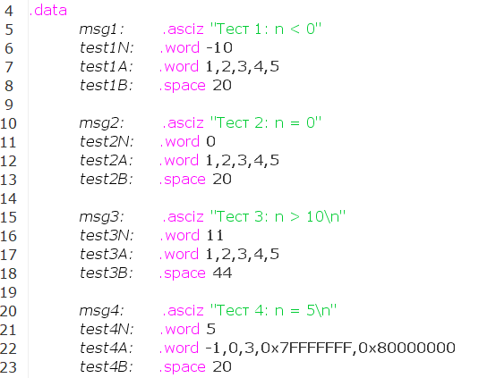
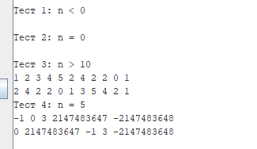

# Отчет по АКОС ИДЗ-1 Вариант 31 Терехов Дмитрий Сергеевич БПИ-249
## Разработка программы на ассемблере RISC-V с использованием подпрограмм и макросов

### 1. Результаты
Разработана программа на ассемблере RISC-V, которая:
- Вводит одномерный массив `A` из `N` элементов;
- Формирует массив `B` в порядке: сначала элементы с **нечетными индексами**, затем с **четными**;
- Выполняет контроль корректности `N` (0 < N ≤ 10);
- Выводит оба массива с поясняющими подписями;
- Использует подпрограммы с передачей параметров через стек и возвратом результата через регистр `a0`;
- Реализует модульную архитектуру с возможностью повторного использования подпрограмм и макросов;
- Содержит автоматизированное тестовое покрытие.
- Поддерживает многократное использование с разными `A` и `N` без завершения работы программы.

---

### 2. Архитектура приложения

Программа разделена на несколько модулей:

- **src/main.asm**  
  Точка входа `main`, организация ввода `N`, вызов подпрограмм ввода массива `A`, формирования `B`, вывода массивов.

- **src/io.asm**  
  Подпрограммы для работы с консолью (ввод/вывод чисел, строк, массивов). Используют системные вызовы (`ecall`).

- **src/array_utils.asm**  
  Подпрограмма `form_arrayB`, формирующая массив `B` из массива `A` согласно заданию. Использует стек для передачи аргументов и локальные переменных.

- **src/macros.asm**  
  Макросы-обертки для вызова подпрограмм (`PRINT_STR`, `PRINT_ARR`, `FORM_ARR`). Поддерживают многократное использование.

- **src/tests.asm**  
  Автоматизированное тестовое покрытие. Использует подготовленные массивы и значения `N` для проверки различных сценариев.

---

### 3. Использование стека и локальных переменных (На примере FORM_ARR)

#### Передача аргументов
Аргументы передаются на стек перед вызовом подпрограммы:
- `addi sp sp -16` — выделяем место на стеке;
- `N` — количество элементов 12(sp);
- `addrA` — адрес массива A 8(sp);
- `addrB` — адрес массива B 4(sp);
- `jal form_arrayB` — вызываем подпрограмму;
- `addi sp sp 16` — освобождаем стек.

#### Локальные переменные
В подпрограммах используются локальных переменные на стеке.

Пример кода с комментариями:
```asm
    # Выделяем место на стеке и сохраняем регистры
    addi sp sp -32
	sw ra 28(sp)
	
	addi t0 sp 32 # t0 = old sp
	# Копируем переданные параметры
	lw t1 12(t0)
	lw t2 8(t0)
	lw t3 4(t0)
	sw t1 24(sp) # N
	sw t2 20(sp) # A
	sw t3 16(sp) # B
	
	# Смещения i, j для A, B
    # i и j новые локальные переменные на стеке
	li t4 4
	sw t4 12(sp) # i
	sw zero 8(sp) # j
```
Больше информации есть в комментариях к коду.

---

### 4. Тестовое покрытие
Создан отдельный модуль `tests.asm`, который осуществляет прогон подпрограммы обработки массива в различных сценариях работы.

#### Тестовые данные


1. `n < 0`: новый массив не формируется.
2. `n = 0`: новый массив не формируется.
3. `n > 10`: все подпрограммы работают корректно и для n > 10.
Это ограничение на n обрабатывается в `main.asm`.
4. `n = 5` (корректный сценарий): Программа работает для любых элементов массива в пределах int32.

#### Результаты тестирования

---


### 5. Макросы
Макросы позволяют упростить вызовы подпрограмм и сделать их универсальными. Далее представлены некоторые из них:

- PRINT_STR(label) — вывод строки;
- PRINT_ARR(n, adr) — вывод массива из n элементов по адресу adr;
- FORM_ARR(n, adrA, addrB) — вызов подпрограммы формирования массива B.

Файл macros.asm подключается как модуль и используется как в основной программе, так и в тестах.