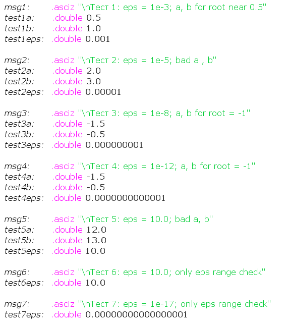

# Отчёт по АКОС ИДЗ-2 Вариант 36 Терехов Дмитрий Сергеевич БПИ-249

## Разработка программы на ассемблере RISC-V с использованием подпрограмм и макросов

### 1. Результаты

Разработана программа на **ассемблере RISC-V (RARS)**, которая:

* Решает уравнение $2^{x^2+1} + x − 3 = 0$ методом **хорд**;
* Позволяет пользователю ввести требуемую **точность $\epsilon$** (от `0.001` до `0.00000001`);
* Проводит вычисления в **заданном диапазоне [2; 3]**;
* Проверяет корректность диапазона (если корень не лежит в нём — подбирает корректный интервал автоматически);
* Выводит найденный **корень уравнения**;
* Реализует вычисление функции, итерационного шага и проверки диапазона через **подпрограммы**;
* Использует **fa** регистры и **стек** для передачи аргументов и возврата результатов;
* Содержит **макросы** для удобного вызова подпрограмм и вывода информации;
* Может многократно выполняться без перезапуска программы.

---

### 2. Архитектура приложения

Программа структурирована на несколько модулей:

* **src/main.asm**
  Точка входа. Реализует:

  * ввод точности $\epsilon$;
  * проверку вхождения $\epsilon$ в заданный диапазон;
  * вызов подпрограммы `segment_method`;
  * вывод вычисленного корня.

* **src/segment_utils.asm**
  Подпрограммы для:

  * вычисления значения функции $f(x) =2x^{x^2+1} + x − 3$;
  * вычисления очередного приближения методом хорд;
  * проверки корректности интервала (разные знаки на концах);
  * итерации по интервалам от scan_start до scan_end.

* **src/io.asm**
  Подпрограммы для ввода/вывода чисел и строк с использованием системных вызовов RARS (`ecall`).

* **src/macros.asm**
  Макросы:

  * `PRINT_STR(label)` — вывод строки;
  * `PRINT_DOUBLE(reg)` — вывод вещественного числа;
  * `READ_DOUBLE(reg)` — ввод вещественного числа.
  * `SEGMENT_METHOD(...)` — вычисление корня методом хорд на переданном отрезке и с переданной точностью.

* **src/tests.asm**
  Набор тестов для проверки корректности вычислений при различных $\epsilon$ и начальных интервалах.

---

### 3. Метод хорд

Метод хорд — итерационный численный метод решения уравнений вида `f(x)=0`.

Используется формула:

$
x_{n+1} = x_n - f(x_n) \frac{x_n - x_{n-1}}{f(x_n) - f(x_{n-1})}
$

В программе:

* начальные значения: `a = 2.0`, `b = 3.0`;
* если `f(a)` и `f(b)` одного знака — интервал корректируется;
* на каждой итерации вычисляются `f(a)` и `f(b)`;
* если `|f(x)| < ε` — процесс завершается.

---

### 4. Использование стека и локальных переменных

В программе присутствуют комментарии, подробно описывающие вызов подпрограмм и макросов.

Передача аргументов происходит как через стек, так и через регистры, в зависимости от подпрограммы. fs и s регистры корректно сохраняются и восстанавливаются на стеке.

Пример передачи аргументов и работы со стеком и регистрами в подпрограмме `calculate_root`:

```asm
.macro SEGMENT_METHOD(%fleft, %fright, %feps, %fres)
	addi sp sp -16
	sw ra 12(sp)
	
	fmv.d fa0 %fleft
	fmv.d fa1 %fright
	fmv.d fa2 %feps
	
	jal calculate_root
	fmv.d %fres fa0
	
	lw ra 12(sp)
	addi sp sp 16
.end_macro

...

calculate_root:
	addi sp sp -64
	sw ra 60(sp)
	fsd fs0 52(sp) # a
	fsd fs1 44(sp) # b
	fsd fs2 36(sp) # eps
	fsd fs3 28(sp) # f_a
	fsd fs4 20(sp) # f_b
	fsd fs5 12(sp) # x_new
	sw s0 8(sp) # i
	
	fmv.d fs0 fa0
	fmv.d fs1 fa1
	fmv.d fs2 fa2
...

end_calculate_root:
	lw ra 60(sp)
	fld fs0 52(sp)
	fld fs1 44(sp)
	fld fs2 36(sp)
	fld fs3 28(sp)
	fld fs4 20(sp)
	fld fs5 12(sp)
	lw s0 8(sp)
	addi sp sp 64
	ret
```

Передача аргументов в подпрограмму `calculate_root`:

* `fa0` — левая граница a
* `fa1` — правая граница b
* `fa2` — точность $\epsilon$
*  Результат (корень) возвращается в `fa0`.

Больше информации есть в комментариях в коде программы.

---

### 5. Тестовое покрытие

Файл `tests.asm` содержит автоматические тесты для проверки корректности работы алгоритма при различных значениях точности ε и различных начальных отрезках.

#### Тестовые данные


#### Ожидаемые результы
Ожидаемые результаты работы алгоритма получнеы через программу на **Python** с использованием сторонней библиотеки **Sympy**. Программа находится в корневой папке проекта (requirements.txt не добавил, инструкций по сборке нет :D).
[Скрипт](./check.py)

1. `eps = 1e-3`: x = 0.544189453125
2. `eps = 1e-5`: x = 0.544223785400
3. `eps = 1e-8`: x = -1.00000000000
4. `eps = 1e-12`: x = -1.00000000000
5. `eps = 10`: в моей простой реализации python-скрипта такую точность поставить нельзя, но ответ в тестовом прогоне ожидаемый, 0.0 в пределах 10 от корня.
6. `eps = 10.0`: проверка проваливается и ставится дефолтное значение 1e-8
7. `eps = 1e-17`: проверка проваливается и ставится
дефолтное значение 1e-8

#### Результаты:


---

### 6. Макросы
Макросы позволяют упростить вызовы подпрограмм и сделать их универсальными. Далее представлены некоторые из них:

- `PRINT_STR(label)` — вывод строки;
- `PRINT_DOUBLE(freg)` — вывод вещественного числа;
- `SEGMENT_METHOD(fleft, fright, feps, fres)` — вызов подпрограммы нахождения корня уравнения из задания.

Файл macros.asm подключается как модуль и используется как в основной программе, так и в тестах.

---

### 7. Источники информации
Информацию для реализации метода хорд брал отсюда и с рандомных ссылок гугла как бороться с разными плохими значениями **a, b**:

[https://simenergy.ru/mathematical-analysis/equations/chord-method]()

---